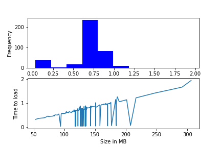

# Results 

## HDF5 No Compression 50 examples
0m 14s
0m 10s
0m 2s
0m 6s
0m 6s
0m 3s
0m 5s
0m 3s
0m 5s
0m 6s
0m 6s
0m 5s
0m 5s
0m 5s
0m 6s
0m 5s
0m 6s
0m 3s
0m 10s
0m 5s
0m 12s
0m 6s
0m 3s
0m 5s
0m 5s
0m 7s
0m 5s
0m 6s
0m 5s
0m 6s
0m 8s
0m 7s
0m 6s
0m 5s
0m 12s
0m 5s
0m 6s
0m 5s
0m 5s
0m 6s
0m 7s
0m 6s
0m 6s
0m 13s
0m 6s
0m 5s
0m 8s
0m 6s
0m 11s
0m 5s

Total time 5m 14s  4m 42s 5m 6s

average time: 6.2s

## HDF GZIP Compression 50 examples

0m 4s
0m 5s
0m 1s
0m 3s
0m 3s
0m 1s
0m 3s
0m 1s
0m 3s
0m 3s
0m 3s
0m 3s
0m 2s
0m 3s
0m 3s
0m 2s
0m 3s
0m 1s
0m 5s
0m 3s
0m 5s
0m 3s
0m 2s
0m 3s
0m 3s
0m 4s
0m 2s
0m 3s
0m 2s
0m 3s
0m 4s
0m 3s
0m 3s
0m 3s
0m 5s
0m 2s
0m 3s
0m 3s
0m 3s
0m 3s
0m 3s
0m 3s
0m 3s
0m 6s
0m 3s
0m 2s
0m 4s
0m 3s
0m 5s
0m 3s

Total Time: 2m 29s  2m 21s 2m 22s
Average Time: 2,98s

## HDF LZF Compression 50 examples

0m 2s
0m 4s
0m 1s
0m 2s
0m 2s
0m 1s
0m 2s
0m 1s
0m 2s
0m 2s
0m 3s
0m 2s
0m 2s
0m 2s
0m 2s
0m 2s
0m 3s
0m 1s
0m 4s
0m 2s
0m 5s
0m 3s
0m 1s
0m 2s
0m 2s
0m 3s
0m 2s
0m 2s
0m 2s
0m 2s
0m 3s
0m 3s
0m 2s
0m 2s
0m 5s
0m 2s
0m 2s
0m 2s
0m 2s
0m 2s
0m 3s
0m 2s
0m 2s
0m 5s
0m 2s
0m 2s
0m 3s
0m 2s
0m 4s
0m 2s

Total time: 2m 5s  1m 47s  1m 48s  
Average time: 2,5s

## CQ500 Summary on Dome's PC
| Dataset Type | Average Time | Max Time | Total Time |
|--------------|--------------|----------|------------|
| Torch        |   0.71s      |   1.95s  |  278.9s    |
| HDF5 Reopen  |   5.76s      |   13.5s  |  2276.3s   |
| HDF5 OpenOnce|              |          |            |
| HDF5 LZF     |              |          |            |
| HDF5 GZIP    |              |          |            |

## CQ500 TorchDataset 395 examples

Total Time: 278.9s
Average Time: 0.706s
Max Time: 1.948s

## CQ500 H5Dataset 395 examples (Reopen file handle on `__getitem__`)

Total Time: 2276.3s
Average Time: 5.76s
Max Time: 13.53s

## CQ500 H5Dataset 395 examples (Open file once)

Total Time:
Average Time: 
Max Time: 
